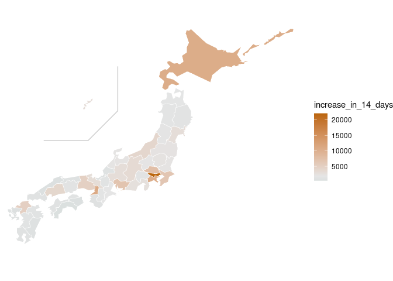
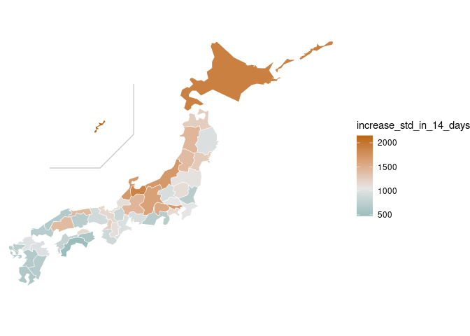
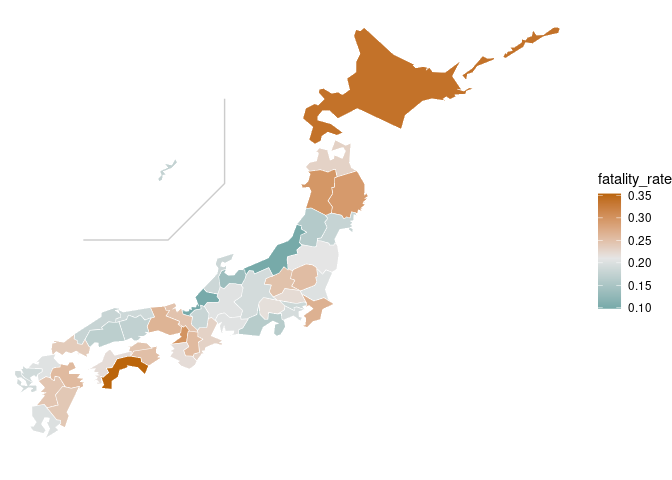
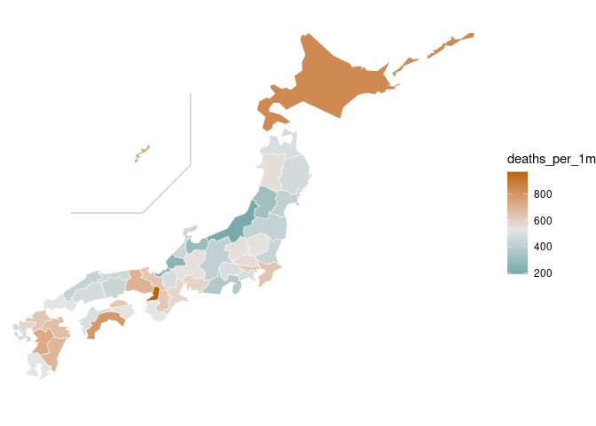

Japan, Covid-19 situation by prefecture
================
Mitsuo Shiota
2021-03-31

- <a href="#summary" id="toc-summary">Summary</a>
- <a href="#read-data-from-mhlw-site"
  id="toc-read-data-from-mhlw-site">Read data from MHLW site</a>
- <a href="#add-population-column" id="toc-add-population-column">Add
  population column</a>
- <a href="#fastest-spreading-prefecutures-in-the-last-14-days"
  id="toc-fastest-spreading-prefecutures-in-the-last-14-days">Fastest
  spreading prefecutures in the last 14 days</a>
- <a href="#highest-fatality-rate-prefectures"
  id="toc-highest-fatality-rate-prefectures">Highest fatality rate
  prefectures</a>
- <a href="#highest-deaths-per-population-prefectures"
  id="toc-highest-deaths-per-population-prefectures">Highest deaths per
  population prefectures</a>

Updated: 2022-11-18

## Summary

I added Japan page to [my Shiny
App](https://mitsuoxv.shinyapps.io/covid/) on March 31, 2021. I used
data of 47 prefectures from [NHK
site](https://www3.nhk.or.jp/news/special/coronavirus/data/).

On September 28, 2022, NHK stopped to collect data by itself, as MHLW
(Ministry of Health, Labour and Welfare) began to publish [the
data](https://www.mhlw.go.jp/stf/covid-19/open-data.html). So, I changed
the source from NHK to MHLW.

## Read data from MHLW site

``` r
conf <- read_csv("https://covid19.mhlw.go.jp/public/opendata/newly_confirmed_cases_daily.csv") %>% 
  pivot_longer(-Date, names_to = "prefecture", values_to = "new_conf") %>% 
  filter(prefecture != "ALL") %>% 
  mutate(publish_date = ymd(Date)) %>% 
  group_by(prefecture) %>% 
  mutate(cum_conf = cumsum(new_conf)) %>% 
  ungroup() %>% 
  select(publish_date, prefecture, new_conf, cum_conf)

deaths <- read_csv("https://covid19.mhlw.go.jp/public/opendata/deaths_cumulative_daily.csv") %>% 
  pivot_longer(-Date, names_to = "prefecture", values_to = "cum_deaths") %>% 
  filter(prefecture != "ALL") %>% 
  mutate(publish_date = ymd(Date)) %>% 
  group_by(prefecture) %>% 
  mutate(
    cum_deaths_lag = lag(cum_deaths),
    new_deaths = cum_deaths - cum_deaths_lag
    ) %>% 
  ungroup() %>% 
  select(publish_date, prefecture, new_deaths, cum_deaths)

prefectures <- tibble(
  prefecture = conf %>% 
    filter(publish_date == "2020-01-16") %>% 
    pull(prefecture),
  code = str_c("0", 1:47) %>% 
    str_sub(start = -2L)
)

data_japan <- conf %>% 
  left_join(deaths, by = c("publish_date", "prefecture")) %>% 
  left_join(prefectures, by = "prefecture")
```

## Add population column

I download population by prefecture data from [the Statistics Bureau,
Ministry of Internal Affairs and
Communications](https://www.stat.go.jp/data/nihon/02.htm). The data are
estimated as of October 1, 2020.

## Fastest spreading prefecutures in the last 14 days

Highest “increase_in_14_days”, which is an increase in cumulative
confirmed cases in the last 14 days, are:

<!-- -->

Above calculation might be unfair to populous prefectures. Highest
“increase_std_in_14_days”, which is an increase in cumulative confirmed
cases in the last 14 days per 1 million population, are:

<!-- -->

## Highest fatality rate prefectures

Among prefectures with more than 10 cumulative deaths, highest
“fatality_rate”, which is cumulative deaths per 100 cumulative confirmed
cases, are:

<!-- -->

## Highest deaths per population prefectures

Highest “deaths_per_1m”, which is cumulative deaths per 1 million
population, are:

<!-- -->

EOL
