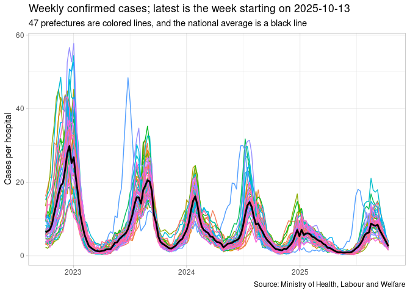

# Japan, weekly confirmed Covid-19 cases per hospital
Mitsuo Shiota
2023-05-20

Updated: 2025-10-03

## Covid-19 was reclassified as tier 5 on May 8, 2023 in Japan

There are no daily data available on Covid-19 since May 8, 2023 in
Japan. Instead, MHLW (Ministry of Health, Labour and Welfare) publishes
weekly data in [its web
site](https://www.mhlw.go.jp/stf/seisakunitsuite/bunya/0000121431_00086.html).

## Read data from MHLW site

    Rows: 48 Columns: 1
    ── Column specification ────────────────────────────────────────────────────────
    Delimiter: ","
    chr (1): prefecture

    ℹ Use `spec()` to retrieve the full column specification for this data.
    ℹ Specify the column types or set `show_col_types = FALSE` to quiet this message.

## 2 csv files

I make 2 csv files.

- japan_wk_cases.csv
- japan_wk_cases_per_hospital.csv

## Weekly confirmed cases per hospital

For more flexible data presentations, please check [my Shiny
app](https://mitsuoxv.shinyapps.io/covid/).

EOL
