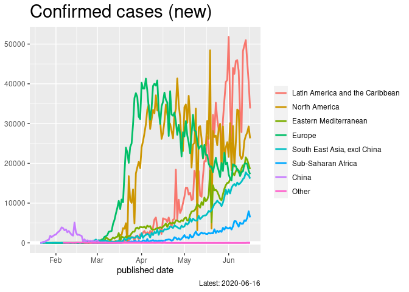

WHO, Covid-19 situation report
================
Mitsuo Shiota
2020/3/7

  - [Summary](#summary)
  - [Load](#load)
  - [Chart](#chart)

Updated: 2020-03-18

## Summary

<https://mitsuoxv.shinyapps.io/covid/>

Coronavirus is affecting the world economy. Uncertaintiy is very high. I
searched around and found some informative sites, like [Coronavirus
Situation
Dashboard](https://who.maps.arcgis.com/apps/opsdashboard/index.html#/c88e37cfc43b4ed3baf977d77e4a0667)
and [Coronavirus Update by
worldometer](https://www.worldometers.info/coronavirus/). But they fail
to offer time-series data of the newly confirmed cases by each area, in
which I am most interested. If the average number of infections one
infected person inflict is even slightly more than one, infections grow
exponentially. If less than one, the newly confirmed cases begin to
decrease, and the virus will be contained eventually in that area.

WHO offers those numbers in [the situation
reports](https://www.who.int/emergencies/diseases/novel-coronavirus-2019/situation-reports/),
which are unfortunately pdf files.

So I scratched numbers from pdf files, scratched my head learning
regular expressions, and made the shiny app above. I would like to
update frequently, but I am not sure. The ugly codes I wrote are in R
directory. Data in Table 1 (In China) and Table 2 (World including
China) in the situation reports are in table1.csv, table2.csv and
tables.rdata in data directory.

## Load

Here, I load Table 1 and Table 2, which I managed to scratch from WHO
situation reports. Beware Table 1 (in\_china) includes total, but Table
2 (world) does not include subtotal or total, as I cut them.

``` r
# load data
load("data/tables.rdata")
```

## Chart

I watch newly confirmed cases. China is suceeding to contain the
coronavirus, but areas outside China now face the challenge.

``` r
table2 %>% 
  left_join(area_cat, by = "area") %>% 
  group_by(publish_date, cat) %>% 
  summarize(new_conf = sum(new_conf, na.rm = TRUE)) %>% 
  ggplot(aes(publish_date, new_conf,
             color = fct_reorder2(cat, publish_date, new_conf))) +
  geom_hline(yintercept = 0, color = "white", size = 2) +
  geom_line(size = 1) +
  labs(
    title = "Confirmed cases (new)",
    x = "published date",
    caption = str_c("Latest: ", max(table2$publish_date)),
    color = NULL
  ) +
  ylab(NULL) +
  theme(
        plot.title = element_text(size = rel(2)))
```

<!-- -->

EOL
