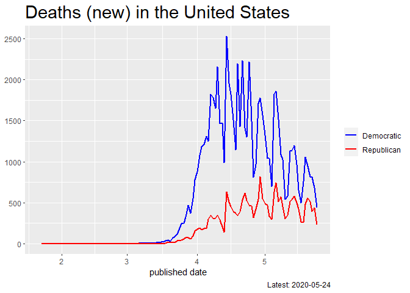

WHO, Covid-19 situation report
================
Mitsuo Shiota
2020/3/7

  - [Summary](#summary)
  - [Load](#load)
  - [Newly confirmed cases by region](#newly-confirmed-cases-by-region)
  - [Fastest spreading areas](#fastest-spreading-areas)
  - [Highest fatality rate areas](#highest-fatality-rate-areas)
  - [Highest deaths per population
    areas](#highest-deaths-per-population-areas)
  - [U.S. deaths (new) by red or blue
    states](#u.s.-deaths-new-by-red-or-blue-states)

Updated: 2020-05-26

## Summary

<https://mitsuoxv.shinyapps.io/covid/>

Coronavirus is affecting the world economy. Uncertaintiy is very high. I
searched around and found some informative sites, like [Coronavirus
Situation
Dashboard](https://who.maps.arcgis.com/apps/opsdashboard/index.html#/c88e37cfc43b4ed3baf977d77e4a0667)
and [Coronavirus Update by
worldometer](https://www.worldometers.info/coronavirus/). But they fail
to offer time-series data of the newly confirmed cases by each area, in
which I am most interested. If the average number of infections one
infected person inflict is even slightly more than one, infections grow
exponentially. If less than one, the newly confirmed cases begin to
decrease, and the virus will be contained eventually in that area.

WHO offers those numbers in [the situation
reports](https://www.who.int/emergencies/diseases/novel-coronavirus-2019/situation-reports/),
which are unfortunately pdf files.

So I scratched numbers from pdf files, scratched my head learning
regular expressions, and made the shiny app above. I would like to
update frequently, but I am not sure. The ugly codes I wrote are in R
directory. Data in Table 1 (In China) and Table 2 (World including
China) in the situation reports are in table1.csv, table2.csv and
tables.rdata in data directory.

Note that the confirmed cases are not the actual cases, due to delays
from infection to symptoms, limited testing capacity, and so on, as
[Nate Silver tells
us](https://fivethirtyeight.com/features/coronavirus-case-counts-are-meaningless/).

I later found [Johns Hopkins University, Coronavirus Resource
Center](https://coronavirus.jhu.edu/) and [Financial Times, Coronavirus
tracked](https://www.ft.com/content/a26fbf7e-48f8-11ea-aeb3-955839e06441)
are very informative, and that they provide some time-series charts of
the newly confirmed cases.

I added the United States page to [my Shiny
App](https://mitsuoxv.shinyapps.io/covid/) on May 25, 2020. I use data
from [USAFacts
page](https://usafacts.org/visualizations/coronavirus-covid-19-spread-map/).

## Load

Here, I load Table 1 and Table 2, which I managed to scratch from WHO
situation reports. Beware Table 1 (in\_china) includes total, but Table
2 (world) does not include subtotal or total, as I cut them.

``` r
# load data
load("data/tables.rdata")
```

## Newly confirmed cases by region

I watch newly confirmed cases. China is suceeding to contain the
coronavirus, but areas outside China now face the challenge.

<!-- -->

## Fastest spreading areas

Among areas with more than 10 million population, highest
“speed\_since\_100”, which is average number of newly confirmed cases
per day since cumulative cases became more than 100, are:

    ## # A tibble: 20 x 4
    ##    area           speed_since_100 cum_conf days_since_100
    ##    <chr>                    <dbl>    <dbl>          <int>
    ##  1 United States           19187.  1592599             83
    ##  2 Russia                   5195.   353427             68
    ##  3 Brazil                   4823.   347398             72
    ##  4 United Kingdom           3203.   259563             81
    ##  5 Spain                    2805.   235772             84
    ##  6 Italy                    2497.   229858             92
    ##  7 Turkey                   2303.   156827             68
    ##  8 Germany                  2099.   178570             85
    ##  9 India                    1927.   138845             72
    ## 10 Peru                     1700.   115754             68
    ## 11 France                   1691.   142204             84
    ## 12 Iran                     1523.   135701             89
    ## 13 Canada                   1134.    84081             74
    ## 14 Saudi Arabia             1006.    72560             72
    ## 15 Chile                     985.    69102             70
    ## 16 Mexico                    981.    65856             67
    ## 17 Pakistan                  802.    56349             70
    ## 18 Belgium                   712.    57092             80
    ## 19 Bangladesh                683.    33610             49
    ## 20 China                     669.    84536            126

Above calculation might be unfair to populous areas. Below
“per\_capita\_cum\_conf” is cumulative cases per 1 million population.
Highest “speed\_std\_since\_100”, which is per day growth of cumulative
cases per 1 million population since cumulative cases became more than
100, are:

    ## # A tibble: 20 x 4
    ##    area           speed_std_since_100 per_capita_cum_conf days_since_100
    ##    <chr>                        <dbl>               <dbl>          <int>
    ##  1 Belgium                       68.5               5488.             80
    ##  2 United States                 61.8               5134.             83
    ##  3 Spain                         60.3               5070.             84
    ##  4 Chile                         58.8               4126.             70
    ##  5 Peru                          56.8               3870.             68
    ##  6 United Kingdom                51.4               4163.             81
    ##  7 Italy                         41.4               3809.             92
    ##  8 Portugal                      39.1               2868.             73
    ##  9 Saudi Arabia                  39.1               2820.             72
    ## 10 Russia                        36.9               2512.             68
    ## 11 Ecuador                       36.4               2485.             68
    ## 12 Netherlands                   33.9               2718.             80
    ## 13 Canada                        33.7               2497.             74
    ## 14 Turkey                        29.6               2016.             68
    ## 15 France                        26.1               2196.             84
    ## 16 Germany                       25.7               2183.             85
    ## 17 Brazil                        24.0               1727.             72
    ## 18 Iran                          19.8               1764.             89
    ## 19 Czech Republic                11.4                855.             74
    ## 20 Romania                       11.4                823.             72

## Highest fatality rate areas

Among areas with more than 10 million population and more than 10
cumulative deaths, highest “fatality\_rate”, which is cumulative deaths
per 100 cumulative confirmed cases, are:

    ## # A tibble: 20 x 4
    ##    area           fatality_rate cum_deaths cum_conf
    ##    <chr>                  <dbl>      <dbl>    <dbl>
    ##  1 France                 19.9       28315   142204
    ##  2 Yemen                  19.0          43      226
    ##  3 Belgium                16.3        9280    57092
    ##  4 Italy                  14.3       32785   229858
    ##  5 United Kingdom         14.2       36793   259563
    ##  6 Netherlands            12.9        5822    45236
    ##  7 Spain                  12.2       28752   235772
    ##  8 Mexico                 10.9        7179    65856
    ##  9 Chad                    8.89         60      675
    ## 10 Ecuador                 8.46       3108    36756
    ## 11 Canada                  7.59       6380    84081
    ## 12 Algeria                 7.22        600     8306
    ## 13 Romania                 6.52       1179    18070
    ## 14 Niger                   6.46         61      945
    ## 15 Brazil                  6.34      22013   347398
    ## 16 Mali                    6.31         65     1030
    ## 17 Burkina Faso            6.25         52      832
    ## 18 Philippines             6.18        868    14035
    ## 19 Indonesia               6.16       1372    22271
    ## 20 United States           6.02      95863  1592599

## Highest deaths per population areas

Among areas with more than 10 million population, highest
“deaths\_per\_1m”, which is cumulative deaths per 1 million
population, are:

    ## # A tibble: 20 x 4
    ##    area           deaths_per_1m cum_deaths pop_mil
    ##    <chr>                  <dbl>      <dbl>   <dbl>
    ##  1 Belgium                892.        9280    10.4
    ##  2 Spain                  618.       28752    46.5
    ##  3 United Kingdom         590.       36793    62.3
    ##  4 Italy                  543.       32785    60.3
    ##  5 France                 437.       28315    64.8
    ##  6 Netherlands            350.        5822    16.6
    ##  7 United States          309.       95863   310. 
    ##  8 Ecuador                210.        3108    14.8
    ##  9 Canada                 189.        6380    33.7
    ## 10 Portugal               123.        1316    10.7
    ## 11 Peru                   113.        3373    29.9
    ## 12 Brazil                 109.       22013   201. 
    ## 13 Germany                101.        8257    81.8
    ## 14 Iran                    96.4       7417    76.9
    ## 15 Mexico                  63.8       7179   112. 
    ## 16 Turkey                  55.8       4340    77.8
    ## 17 Romania                 53.7       1179    22.0
    ## 18 Chile                   42.9        718    16.7
    ## 19 Czech Republic          30.1        315    10.5
    ## 20 Poland                  25.9        996    38.5

## U.S. deaths (new) by red or blue states

I am worrying that too vigorous “reopen economy” movements in the red
states in the United States may cause the second wave. I separate red or
blue by state governors (in case of DC, a mayor), according to [List of
United States
governors](https://en.wikipedia.org/wiki/List_of_United_States_governors).

<!-- -->

EOL
