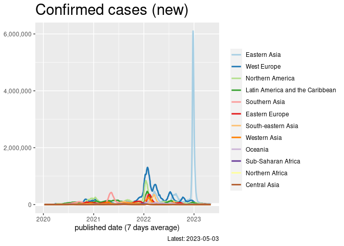

WHO, Covid-19 situation report
================
Mitsuo Shiota
2020-03-07

-   [Summary](#summary)
-   [Read data from WHO](#read-data-from-who)
-   [Newly confirmed cases by region](#newly-confirmed-cases-by-region)
-   [Fastest spreading areas](#fastest-spreading-areas)
-   [Highest fatality rate areas](#highest-fatality-rate-areas)
-   [Highest deaths per population
    areas](#highest-deaths-per-population-areas)

<!-- badges: start -->

<!-- badges: end -->

Updated: 2021-12-28

I added “Japan, Covid-19 situation by prefecture” in [another
page](Japan.md). I added “USA, Covid-19 situation by state” in [another
page](USA.md).

## Summary

<https://mitsuoxv.shinyapps.io/covid/>

Coronavirus is affecting the world economy. Uncertaintiy is very high. I
searched around and found some informative sites, like [Coronavirus
Situation
Dashboard](https://who.maps.arcgis.com/apps/opsdashboard/index.html#/c88e37cfc43b4ed3baf977d77e4a0667)
and [Coronavirus Update by
worldometer](https://www.worldometers.info/coronavirus/). But they fail
to offer time-series data of the newly confirmed cases by each area, in
which I am most interested. If the average number of infections one
infected person inflict is even slightly more than one, infections grow
exponentially. If less than one, the newly confirmed cases begin to
decrease, and the virus will be contained eventually in that area.

Note that the confirmed cases are not the actual cases, due to delays
from infection to symptoms, limited testing capacity, and so on, as
[Nate Silver tells
us](https://fivethirtyeight.com/features/coronavirus-case-counts-are-meaningless/).

I later found [Johns Hopkins University, Coronavirus Resource
Center](https://coronavirus.jhu.edu/) and [Financial Times, Coronavirus
tracked](https://www.ft.com/content/a26fbf7e-48f8-11ea-aeb3-955839e06441)
are very informative, and that they provide some time-series charts of
the newly confirmed cases.

I added the United States page to [my Shiny
App](https://mitsuoxv.shinyapps.io/covid/) on May 25, 2020. I use data
from [USAFacts
page](https://usafacts.org/visualizations/coronavirus-covid-19-spread-map/).

## Read data from WHO

WHO offers [Data Table in its Dashboard](https://covid19.who.int/table).
I use the data from
<https://covid19.who.int/WHO-COVID-19-global-data.csv>.

I also use the data, like area name and population, from
<https://countrycode.org/>.

## Newly confirmed cases by region

I watch newly confirmed cases. China is suceeding to contain the
coronavirus, but areas outside China now face the challenge.

Region classification is mostly based on [UN M49
Standard](https://unstats.un.org/unsd/methodology/m49/). One exception
is “West Europe”, which I make by combining “Western”, “Northern” and
“Southern Europe”. “West Europe” is basically Europe other than “Eastern
Europe”.

<!-- -->

## Fastest spreading areas

Among areas with more than 5 million population, highest
“speed\_since\_100”, which is average number of newly confirmed cases
per day since cumulative cases became more than 100, are:

    ## # A tibble: 20 × 4
    ##    area           speed_since_100 cum_conf days_since_100
    ##    <chr>                    <dbl>    <dbl>          <int>
    ##  1 United States           77856. 51696204            664
    ##  2 India                   53282. 34793333            653
    ##  3 Brazil                  33992. 22230737            654
    ##  4 United Kingdom          17908. 11891296            664
    ##  5 Russia                  16048. 10415230            649
    ##  6 Turkey                  14339.  9306233            649
    ##  7 France                  13313.  8866364            666
    ##  8 Germany                 10503.  7005289            667
    ##  9 Iran                     9217.  6184762            671
    ## 10 Spain                    8598.  5718008            665
    ## 11 Argentina                8426.  5460042            648
    ## 12 Italy                    8391.  5647313            673
    ## 13 Colombia                 7891.  5121668            649
    ## 14 Indonesia                6526.  4261879            653
    ## 15 Poland                   6209.  4054865            653
    ## 16 Mexico                   6031.  3950200            655
    ## 17 Ukraine                  5672.  3646988            643
    ## 18 South Africa             5260.  3413540            649
    ## 19 Netherlands              4644.  3065010            660
    ## 20 Philippines              4347.  2838640            653

Above calculation might be unfair to populous areas. Below
“per\_capita\_cum\_conf” is cumulative cases per 1 million population.
Highest “speed\_std\_since\_100”, which is per day growth of cumulative
cases per 1 million population since cumulative cases became more than
100, are:

    ## # A tibble: 20 × 4
    ##    area           speed_std_since_100 per_capita_cum_conf days_since_100
    ##    <chr>                        <dbl>               <dbl>          <int>
    ##  1 Czech Republic                357.             233654.            655
    ##  2 Belgium                       295.             195916.            663
    ##  3 United Kingdom                287.             190723.            664
    ##  4 Israel                        283.             185701.            655
    ##  5 Netherlands                   279.             184140.            660
    ##  6 Serbia                        271.             175697.            648
    ##  7 Jordan                        255.             164329.            645
    ##  8 United States                 251.             166637.            664
    ##  9 Switzerland                   243.             161119.            664
    ## 10 Slovakia                      234.             151577.            649
    ## 11 Austria                       234.             153667.            658
    ## 12 France                        206.             136893.            666
    ## 13 Argentina                     204.             132066.            648
    ## 14 Sweden                        202.             133249.            660
    ## 15 Denmark                       195.             128170.            658
    ## 16 Hungary                       193.             124756.            647
    ## 17 Spain                         185.             122952.            665
    ## 18 Turkey                        184.             119611.            649
    ## 19 Portugal                      183.             119875.            654
    ## 20 Brazil                        169.             110544.            654

## Highest fatality rate areas

Among areas with more than 5 million population and more than 10
cumulative deaths, highest “fatality\_rate”, which is cumulative deaths
per 100 cumulative confirmed cases, are:

    ## # A tibble: 20 × 4
    ##    area        fatality_rate cum_deaths cum_conf
    ##    <chr>               <dbl>      <dbl>    <dbl>
    ##  1 Yemen               19.6        1983    10115
    ##  2 Peru                 8.89     202488  2278807
    ##  3 Mexico               7.56     298759  3950200
    ##  4 Sudan                7.15       3298    46100
    ##  5 Ecuador              6.25      33624   538218
    ##  6 Syria                5.74       2875    50089
    ##  7 Egypt                5.67      21608   381343
    ##  8 Somalia              5.66       1333    23532
    ##  9 Afghanistan          4.66       7354   157951
    ## 10 China                4.36       5699   130858
    ## 11 Bulgaria             4.16      30574   734720
    ## 12 Niger                3.77        274     7271
    ## 13 Myanmar              3.63      19257   529813
    ## 14 Paraguay             3.57      16599   465233
    ## 15 Tunisia              3.53      25532   723093
    ## 16 Bolivia              3.39      19546   576602
    ## 17 Indonesia            3.38     144063  4261879
    ## 18 Malawi               3.28       2332    71007
    ## 19 Mali                 3.26        654    20080
    ## 20 Romania              3.25      58551  1802745

## Highest deaths per population areas

Among areas with more than 5 million population, highest
“deaths\_per\_1m”, which is cumulative deaths per 1 million population,
are:

    ## # A tibble: 20 × 4
    ##    area           deaths_per_1m cum_deaths pop_mil
    ##    <chr>                  <dbl>      <dbl>   <dbl>
    ##  1 Peru                   6771.     202488   29.9 
    ##  2 Bulgaria               4277.      30574    7.15
    ##  3 Hungary                3881.      38743    9.98
    ##  4 Czech Republic         3418.      35805   10.5 
    ##  5 Brazil                 3075.     618392  201.  
    ##  6 Slovakia               3015.      16445    5.46
    ##  7 Argentina              2831.     117035   41.3 
    ##  8 Colombia               2715.     129729   47.8 
    ##  9 Belgium                2706.      28149   10.4 
    ## 10 Romania                2666.      58551   22.0 
    ## 11 Mexico                 2656.     298759  112.  
    ## 12 United States          2607.     808701  310.  
    ## 13 Paraguay               2603.      16599    6.38
    ## 14 Poland                 2451.      94365   38.5 
    ## 15 Tunisia                2411.      25532   10.6 
    ## 16 United Kingdom         2371.     147857   62.3 
    ## 17 Chile                  2331.      39034   16.7 
    ## 18 Ecuador                2273.      33624   14.8 
    ## 19 Italy                  2264.     136611   60.3 
    ## 20 Russia                 2169.     305155  141.

EOL
