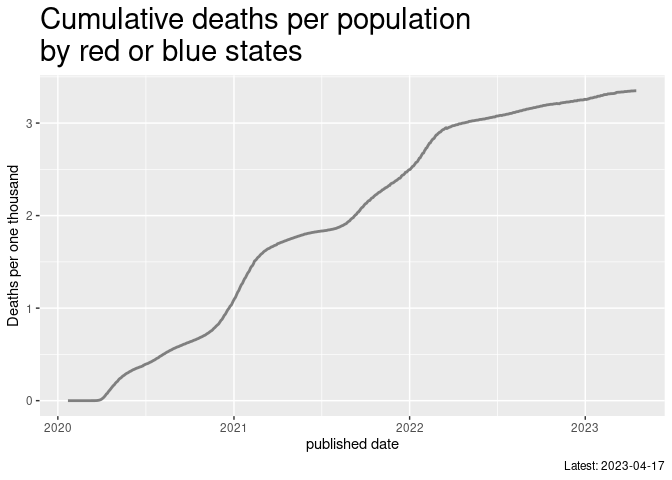
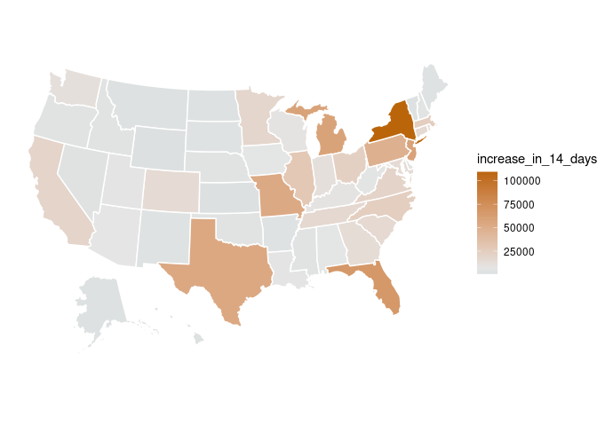
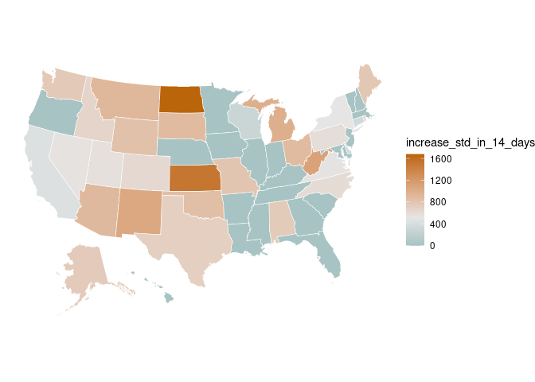
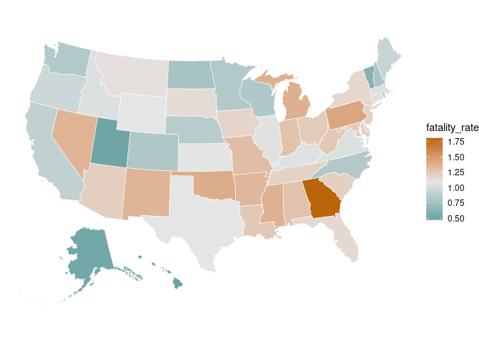
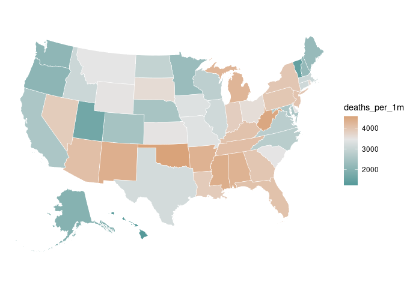

USA, Covid-19 situation by state
================
Mitsuo Shiota
2020/5/26

-   [Summary](#summary)
-   [U.S. confirmed cases (new) by red or blue
    states](#u.s.-confirmed-cases-new-by-red-or-blue-states)
-   [Fastest spreading states in the last 14
    days](#fastest-spreading-states-in-the-last-14-days)
-   [Highest fatality rate states](#highest-fatality-rate-states)
-   [Highest deaths per population
    states](#highest-deaths-per-population-states)

Updated: 2021-01-30

## Summary

I added the United States page to [my Shiny
App](https://mitsuoxv.shinyapps.io/covid/) on May 25, 2020. I use data
of 50 states and 1 federal district (District of Columbia) from
[USAFacts
page](https://usafacts.org/visualizations/coronavirus-covid-19-spread-map/).

I separate red or blue by state governors (in case of DC, a mayor),
according to [List of United States
governors](https://en.wikipedia.org/wiki/List_of_United_States_governors).
Out of the map below, Alaska is red and Hawaii is blue. I download
population data in data directory from [Census Bureau
page](https://www.census.gov/data/tables/time-series/demo/popest/2010s-state-total.html),
and use estimated population as of July 1, 2019.

<!-- -->

## U.S. confirmed cases (new) by red or blue states

I am worrying that too vigorous “reopen economy” movements in the red
states in the United States may cause the second wave.

<!-- -->

Populations in millions by red or blue are:

    ## # A tibble: 2 x 2
    ##   party      pop_mil
    ##   <chr>        <dbl>
    ## 1 Democratic    178.
    ## 2 Republican    151.

## Fastest spreading states in the last 14 days

Highest “increase\_in\_14\_days”, which is an increase in cumulative
confirmed cases in the last 14 days, are:

<!-- -->

Above calculation might be unfair to populous states. Highest
“increase\_std\_in\_14\_days”, which is an increase in cumulative
confirmed cases in the last 14 days per 1 million population, are:

<!-- -->

## Highest fatality rate states

Among states with more than 10 cumulative deaths, highest
“fatality\_rate”, which is cumulative deaths per 100 cumulative
confirmed cases, are:

<!-- -->

## Highest deaths per population states

Highest “deaths\_per\_1m”, which is cumulative deaths per 1 million
population, are:

<!-- -->

EOL
